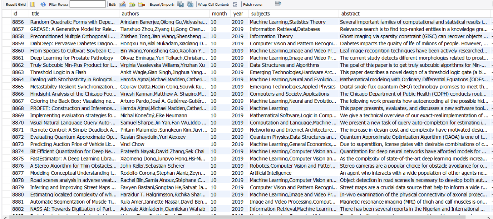
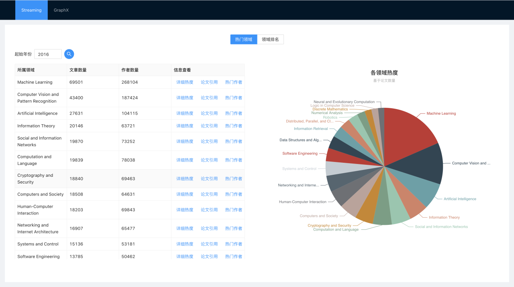
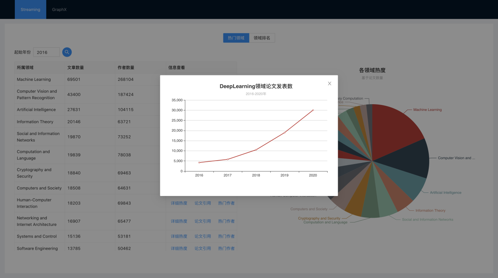
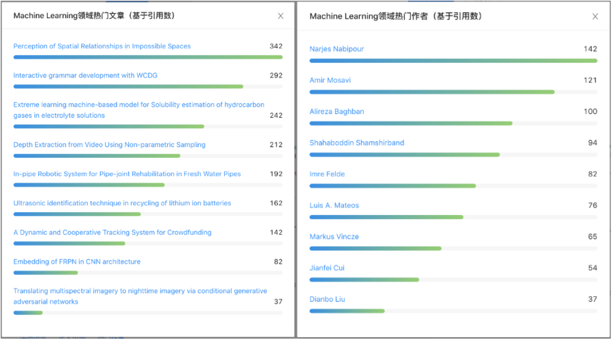
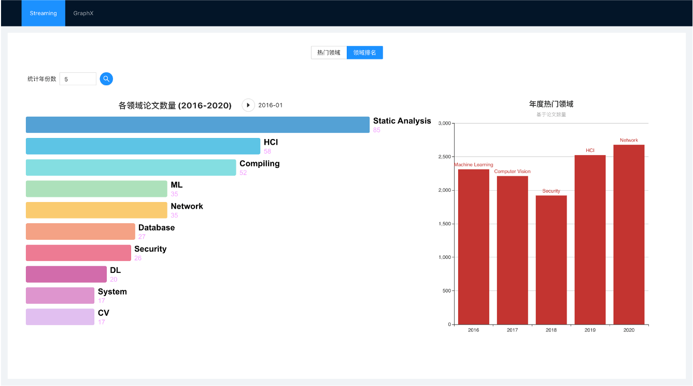
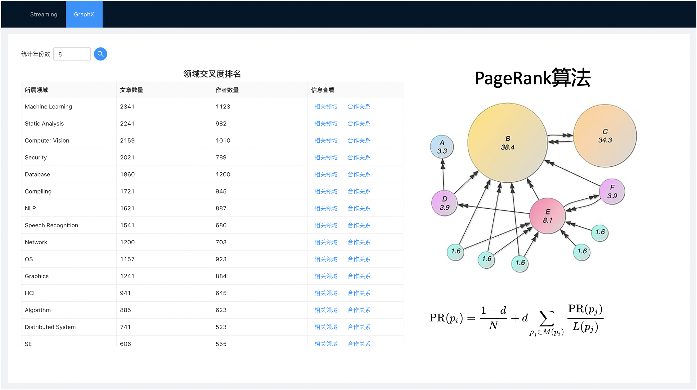
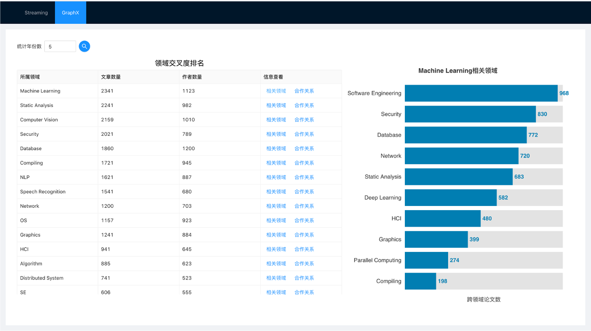
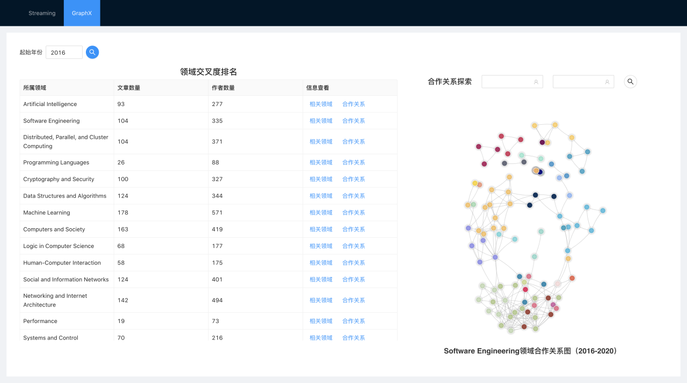
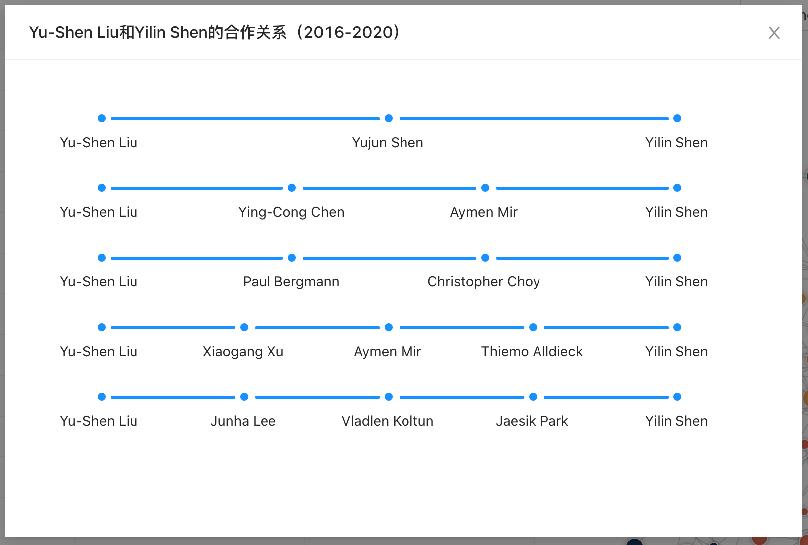

\1. 两个作业合并写一份word说明文档（命名为：组号-选题），必须包括以下内容：

（1）作业选题的应用场景，待解决的业务需求或待回答的研究问题，至少包括三个业务需求或者研究问题。

（2）数据来源及数据内容，包括数据获取方式（解释关键代码）、数据格式、存储方式、预处理过程（解释关键代码）等。

（3）流/图计算总体架构。流分为三个部分（均需解释关键代码）：流准备和监听、流计算、计算结果动态展示；图计算分为两个部分：图构造过程、基于图的计算过程。

（4）结合计算结果解释业务需求实现情况或研究问题的探究结果。

（5）两个作业中各个环节中遇到的困难及最终解决方案。

# 云计算04组-CS领域论文数据分析

陈骁MF20320019，廖均达MF20320088 
胡本霖MF20320065，朱思源MF20320240

[TOC]

## Streaming

### I. Streaming应用场景

计算机领域也有多个子领域，每个子领域获得的投入和关注度也是不同的，随着时间的变化，研究热潮也在发生改变，对于我们而言，这几年感受最深的就是 AI 相关领域的崛起，直到现在还保持着极高的热度。那么其他的子领域的热度是怎么样的，某个领域内部不同作者的热门程度是什么样的？我们希望对其进行一番探究，从而能够对计算机领域的发展形势有一定的了解。

首先我们进行了以下的这些假设：

- 某个领域的热门程度和该领域在特定时间段内产出的论文数量相关
- 某个作者的热门程度和该作者的论文被引用数量相关

从而可以得到具体的业务问题：

1. 统计特定时间段内热度靠前的领域并比较各领域热度
2. 统计特定时间段内某领域的论文发表数量变化趋势
3. 统计特定时间段内某领域的热门论文和作者
4. 分析特定时间段内各领域的热度变化趋势
5. 分析特定时间段内每年的最热门领域

### II. Streaming数据获取

#### 2.1 数据来源

 Arxiv、IEEE 和 ACM 三个影响力较大的论文数据库网站，这些网站保存的数据基本上涵盖了CS领域有影响力的会议和期刊，可以较好地反应高水平CS研究的变化趋势，我们选择爬取它们从 2000 年到现在为止的 CS 领域的论文数据，了解近20年来CS领域的发展。

各个网站的数据规模大致为：ACM和IEEE各40万条，Arxiv大约30万条。此外，由于IEEE和ACM是正式的论文数据库，而arxiv则是论文预印本网站，各个网站之间可能存在数据重复，我们会进行去重处理，处理后的数据规模大约为50万条。

每一篇论文的信息包括：论文题目，作者，发表月份，发表年份，论文所属领域，引用数量。论文的多维度信息允许我们从领域、时间、作者等多个角度入手，基于Streaming和GraphX挖掘潜在的有用信息，帮助我们加深对于CS各个领域发展趋势的认识。论文信息的一个示例如下所示：

#### 2.2 数据获取

爬虫，数据格式（比如写个json对象），关键代码

#### 2.3 数据预处理

解释关键代码

#### 2.4 数据存储

#### 2.5 困难和解决方案

### III. 流计算总体架构

#### 3.1 流准备和监听

#### 3.2 流计算

#### 3.3 计算结果动态展示

#### 3.4 困难和解决方案

### IV. 业务需求实现

#### 4.1 领域热度统计

针对业务问题「统计特定时间段内热度靠前的领域并比较各领域热度」，我们的实现是：用户选择要统计的时间段（默认为5年）之后，调用Streaming计算各领域在该时间段内的作者数和产出的论文数，并以论文数作为该领域热度的标准进行排名，返回热度最高的前20个领域，并用表格和饼图来展示，相关系统的运行截图如下所示。

表格按照热度的降序展示各个领域的基本信息，并提供了进一步展示各个领域详细信息的用户接口（见[4.2 论文数量变化](# 4.2 论文数量变化)和[4.3 热门论文和作者](# 4.3 热门论文和作者)）；饼图中则按照论文数量设置各区域的大小，直观比较各领域的热门程度。通过实现此业务需求，我们帮助用户把握近年来各领域的发展趋势，抓住当前的热门领域。

例如，正如我们所猜测的，近年来算力的大幅提升和深度学习技术的广泛应用，使得AI领域以及CV、NLP等应用深度学习技术的子领域在热门程度上独占鳌头。这反映了这些领域存在大量可供探索的新问题和亟待优化的旧方法，存在较为广阔的研究前景，是值得关注的热门领域。

#### 4.2 论文数量变化

针对业务问题「统计特定时间段内某领域的论文发表数量变化趋势」，根据用户输入的统计年份数以及在表格中选择的领域信息，我们调用Streaming计算该领域在该时间段内每年的论文产出，相关系统的运行截图如下所示。

这么做的理由在于，论文发表数是领域热度的晴雨表：当论文数量逐步上升，说明当前领域方兴未艾，可探索空间较广；当论文数量逐年下降，说明当前领域可能正走向寒冬，在之后一段时间可能处于艰难期；当论文数量居高不下，意味着虽然领域本身势头强劲，但是也存在着竞争激烈、鱼龙混杂等问题。

另一个值得关注论文发表数的理由在于：某一领域内部也存在“大小年”的区别，例如在具有重要启发意义的GAN提出之后，必然在之后的几年内引起GAN应用论文发表的热潮，通过关心这样的数量变化趋势，能够帮助我们把握该领域一些重要论文的影响，对领域热度的变化有更加清晰直观的了解。

#### 4.3 热门论文和作者

 针对业务问题「统计特定时间段内某领域的热门论文和作者」，根据用户输入的统计年份数以及在表格中选择的领域信息，我们调用Streaming计算该领域在该时间段内各篇论文和各个作者的被引用数，并返回被引用数最高的前10篇论文和前10位作者，使用排行榜进行展示。相关系统的运行截图如下所示。

通过搜索某一领域内热门的论文和作者，我们可以了解到该领域的前沿发展，着眼于该领域内有影响力的工作：那些高引用的论文往往是这一领域的经典论文，是很多后续研究的基石；而高引用的作者意味着他的工作被同行广泛认可，是值得关注和借鉴的。

#### 4.4 领域热度变化/年度热门领域

 针对业务问题「分析特定时间段内各领域的热度变化趋势」，我们的实现是：用户选择要统计的时间段（默认为5年）之后，调用Streaming计算各领域在该时间段内每个月产出的论文数，并以从开始时刻至当前月份的论文总数作为该领域热度的排名，每个月份返回热度最高的前10个领域，使用动态排名展示结果，相关系统的运行截图如下图左半部分所示。

各领域的动态排名反映了特定时间段内不同领域此消彼长的趋势，其中长期排名领先的领域则可以毫无置疑地被看作近年来的热门领域；那些逐渐离开排行榜的领域可能是因为遇到发展瓶颈、热度消退；而异军突起的新领域则有可能是在近年来有了突破性的成果，带动了相关研究的深入。

此外，为了体现数据流的实时性，我们使用Streaming监听特定文件夹以读取新的数据。初始状态下所有的论文数据都没有被读取，在用户输入查找的时间段之后，系统会查找该时间段没有被读取过的论文数据，将其移至该文件夹以供Streaming读取，并记录相应时间段的数据已被读取。在这个过程中，前端会定时更新数据，显示已被Streaming读取的数据总量，以体现数据流读取的过程。用户随时可以访问一段时间内的动态排名，但是这个排名数据是基于Streaming已经读取的数据得到的，这个结果虽然是“不完全”的，但是和Streaming已经获取到的所有数据是匹配的，这体现了Streaming实时流式计算的特点。

 针对业务问题「分析特定时间段内每年的最热门领域」，我们的实现是：用户选择要统计的时间段（默认为5年）之后，调用Streaming计算各领域在该时间段内每年产出的论文数，从而计算得到每年热度最高的领域，使用柱状图展示结果，相关系统的运行截图如上图右半部分所示。

如果说动态排名以增量化的方式展示了各个领域的热度对比，那么柱状图则关注每年热门领域的变化，希望形成对于热门领域变迁的总体印象。

### 

## GraphX

### I. GraphX应用场景

在Streaming应用场景中，我们基于各个领域的论文数比较了不同领域的热门程度。除此之外，我们也希望关注各个领域之间的关系，了解某个领域可以和哪些领域产交叉；在某一个领域内部我们则希望寻找紧密合作的学术圈子，以及探寻作者之间的合作关系。在这个过程中，我们可以在和自己领域交叉的领域中发现新的创新点，以及找到和别的作者的合作路径，进而取得更加优秀的学术成果。

首先我们进行了以下的这些假设。

-  我们假设两个领域的交叉是指有论文同属于两个不同的领域
- 一个领域能够和更多的领域交叉，意味着它包含更多等待解决的问题，有更好的发展前景
- 我们假设两个作者的合作是指他们曾经合作发表过论文

我们具体要解决的问题如下：

1. 统计特定时间段内各个领域和其他领域的交叉程度，并找出交叉程度高的领域
2. 统计特定时间段内和某领域交叉程度较高的领域
3. 探究某领域内作者间的合作情况，寻找各个作者所活跃的课题小组
4. 计算两个作者关系可以通过哪些合作者产生合作，探寻两个作者之间可能的合作关系

### II. GraphX数据获取

同[Streaming数据获取](# II. Streaming数据获取)。

### III. 图计算总体架构

#### 3.1 图构造过程

#### 3.2 基于图的计算过程

#### 3.3 困难和解决方案

### IV. 业务需求实现

#### 4.1 领域交叉统计

 针对业务问题「统计特定时间段内各个领域和其他领域的交叉程度，并找出交叉程度高的领域」，我们的实现是：用户选择要统计的时间段（默认为5年）之后，调用pagerank算法计算各领域的权重值，并按照该权重值作为该领域和其他领域交叉程度的标准进行排名，返回交叉程度最高的前20个领域，并用表格来展示，相关系统的运行截图如下所示。

pagerank算法是谷歌公司用户计算网页重要程度的算法，一个网页的权重除了常数之外，只依赖于所有包含了该网页链接的网页的权重值，通过迭代式更新所有网页的权重可以得到较稳定的结果。在pagerank算法中，那些被众多网页所链接的网页具有更高的权重值，而被具有较高权重值的网页所链接的网页也能够获得较高的权重值。

类似地，我们可以将这个算法应用到科研领域间的关系上，网页的链接可以理解成科研领域的交叉，只不过网页链接是单向的而领域间的交叉是双向的。那些权重值较高的领域，往往和许多领域产生交叉，这为该领域的研究提供了大量的可供探索的空间和亟待解决的问题，该领域拥有广阔的发展前景；和高权重领域产生交叉的领域，意味着该领域本身的研究目标具有一定的价值，可以和交叉程度高的领域产生一定程度的共鸣。通过这种方法，我们了解到了可以和多领域交叉复合的领域，相关领域的工作往往拥有更高的应用价值。

#### 4.2 相关领域排名

 针对业务问题「统计特定时间段内和某领域交叉程度较高的领域」，我们的实现是：根据用户输入的统计年份数以及在表格中选择的领域信息，我们调用GraphX计算该领域在该时间段内交叉程度最高的10个领域，相关系统的运行截图如下所示。

“领域交叉统计”按照pagerank权重展示了交叉复合程度高的领域，而本业务需求则是立足于某一特定领域，寻找与关联密切的领域。排名的依据是同属于两个领域的论文数量，数量越多意味着两个领域交叉复合越紧密。在“领域交叉统计”业务需求中没有按照论文数据计算的原因在于，在讨论所有领域的情况下，pagerank能够考虑到关联领域权重对于领域自身权重的影响，突出和“中心领域”关联密切的领域，而单纯依赖论文数量的统计结果不能将相关领域的权重带入本领域权重的计算；但是从特定领域出发寻找相关领域，关注的是和此领域的关联性，所以用跨领域的论文数作为统计依据更加合适。

通过查找和当前领域交叉复合程度高的领域，可以为特定领域的研究人员提供可能的研究方向，也能够进一步促进研究人员之间的跨领域合作，找到新的值得关注的问题。

#### 4.3 领域内合作情况

针对业务问题「探究某领域内作者间的合作情况，寻找各个作者所活跃的课题小组」，我们的实现是：根据用户输入的统计年份数以及在表格中选择的领域信息，我们调用GraphX计算该领域在该时间段内不同作者的分组情况，使用关系图展示结果，每一个节点代表一名作者，节点的大小代表作者的合作者数量，同一颜色的节点表示对应的作者合作关系较为紧密。相关系统的运行截图如下所示。

该业务需求的目的是在特定领域构建作者的人际关系图，探寻作者间的合作关系，希望了解和某个作者合作紧密的人，以及通过他可以接触到的人（这些人通常和该作者属于同一课题组）。这么做的理由在于：同一个课题组的人会一起发论文，构成一个聚类簇；不同机构的人不会一起发论文，他们就会被分开。

于是可以使用connectedComponents方法，将图划分成几个连通区域，对临时聚类簇进行合并。因为不同课题组之间可能有交流访问等情况，为了避免“偶然的合作”，在计算聚类簇的时候，只有合作发论文超过3篇的人才真正放在同一聚类簇里。这种做法是基于一个有趣的事实：只合作过1篇论文及以下的情况占据了所有合作情况的90%，而超过3篇论文的“紧密合作”则只占2%。

通过限制合作数量，能够更好地将作者划分至不同的聚类簇中，了解作者间的合作情况。值得注意的是，在结果展示的时候，不超过3篇论文的“松散合作”仍然会被记入作者的合作者数量中。

#### 4.4 合作关系探索

针对业务问题「计算两个作者关系可以通过哪些合作者产生合作，探寻两个作者之间可能的合作关系」，我们的实现是：根据用户输入的统计年份数以及在表格中选择的领域信息，我们调用GraphX计算该领域在该时间段内两名作者可能的合作路径，每条合作路径上两两相邻的作者共同合作发表过论文。相关系统的运行截图如下所示。

通过合作路径可以清晰直观地展示两名作者间的人际关系，探寻在未来展开合作的可能。例如Yu-Shen Liu希望和在领域内颇具影响力的Yilin Shen合作发表论文，于是可以通过与两人都展开过合作的Yujun Shen的介绍与Yilin Shen建立联系。在这里的合作是一个双向的关系，可以从Yu-Shen Liu出发找到Yilin Shen，也可以从Yilin Shen出发找到Yu-Shen Liu。

合作者探索的搜索过程中使用了GraphX的广度优先搜索（bfs）算法，为了避免资源的消耗，需要设置最大路径长度。在系统中，该路径长度被设定为4，也就是说除了查找的两名作者之外，最多只能有3个中间人，这么做的理由是过长的合作路径会导致较大的沟通成本，无法展开有效的合作。

